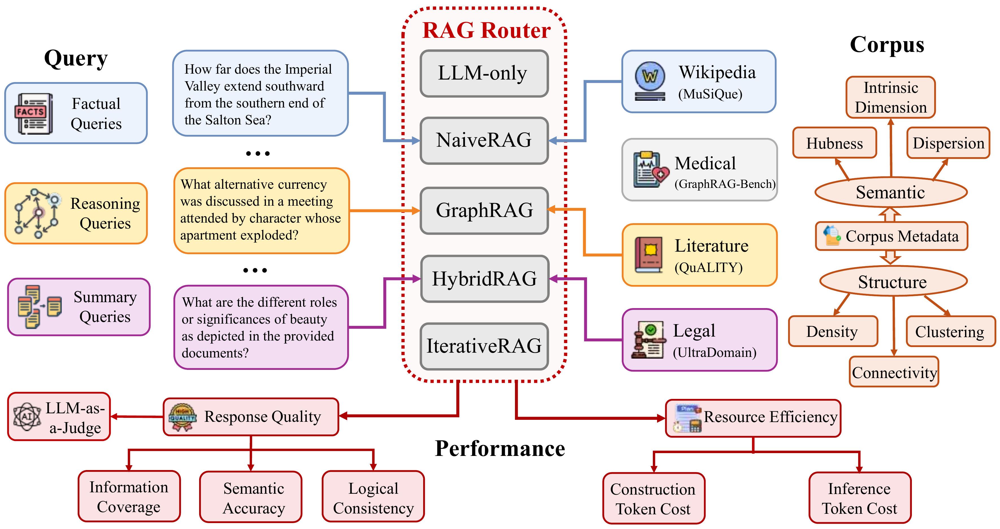
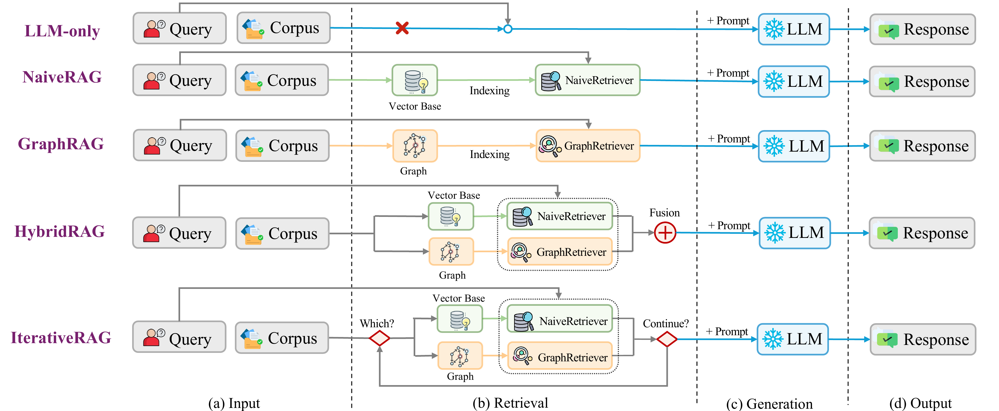
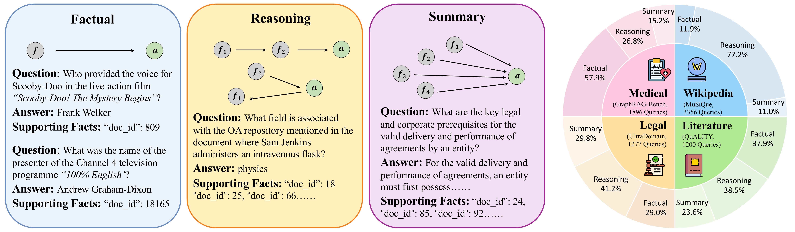
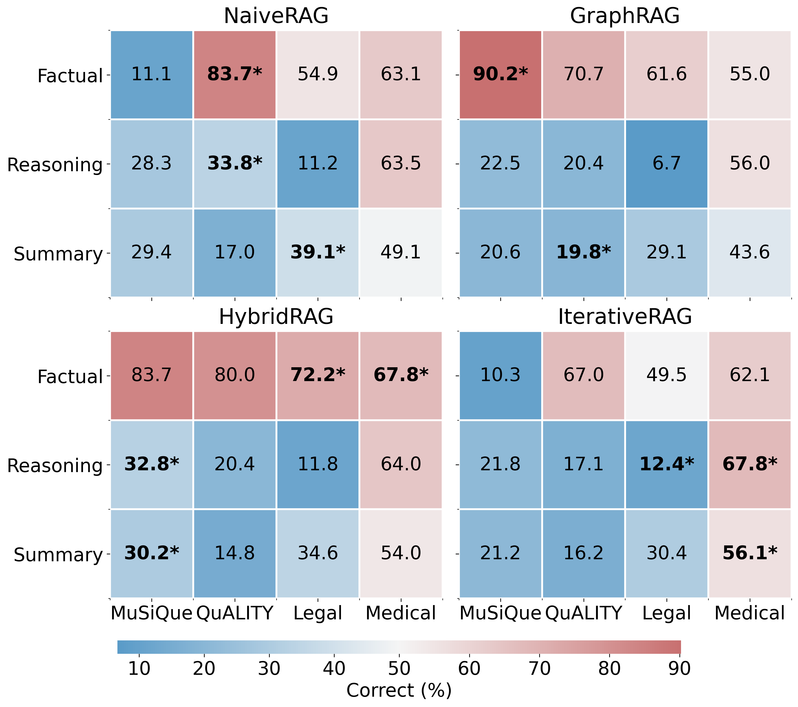
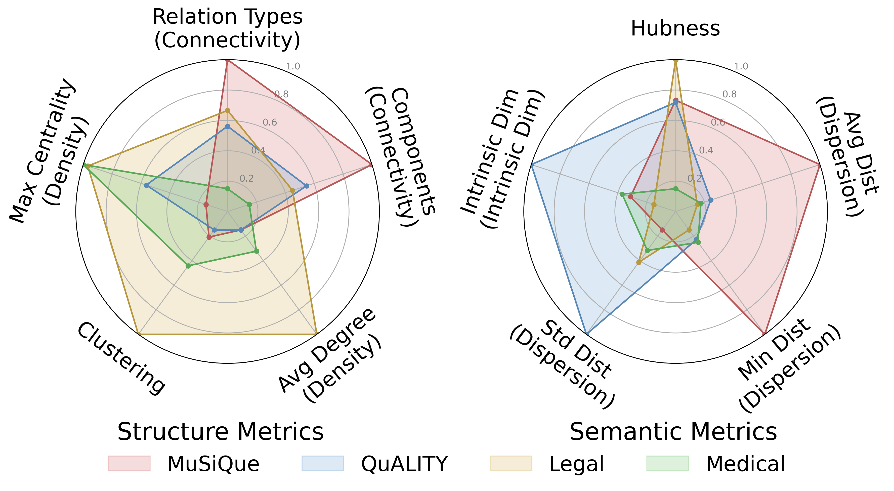

# RAGRouter-Bench

[](https://opensource.org/licenses/MIT)
[](https://www.python.org/downloads/)

**A Comprehensive Benchmark Framework for Retrieval-Augmented Generation (RAG) Routing and Query-Corpus Compatibility.**

## 📖 Overview



RAGRouter-Bench is the first benchmark designed to evaluate **Query-Corpus Compatibility** in RAG systems. It provides a unified framework for comparing different RAG paradigms (LLM-only, Naive, Graph, Hybrid, Iterative) and helps determine which retrieval strategy works best for different query-corpus combinations.

**Key Features:**
- Models each instance as a **(query, corpus, method, performance)** tuple
- Comprises **7,727 queries** over **21,460 documents**
- Supports systematic analysis of routing behaviors across diverse settings


## 🌟 Features



- **Five RAG Paradigms**: LLM-only, NaiveRAG, GraphRAG, HybridRAG, IterativeRAG
- **Multi-dimensional Evaluation**: Response quality metrics and resource efficiency analysis
- **Dual-view Corpus Characterization**: Structural (connectivity, density, clustering) and Semantic (hubness, dispersion, intrinsic dimension) properties
- **Modular Design**: Decoupled Chunking, Indexing, and Retrieval modules

## 🛠️ Installation

```bash
git clone https://anonymous.4open.science/r/RAGRouter-Bench/
cd RAGRouter-Bench

# Create environment
conda env create -f environment.yml
conda activate ragBench

# Setup API Keys (configure in Config/LLMConfig.py)
# Set your DEEPSEEK_API_KEY or OPENAI_API_KEY
```

## 📂 Data Preparation



### Datasets

RAGRouter-Bench includes four datasets spanning different domains:

| Dataset | Domain | Queries | Documents | Avg. Tokens | Total Tokens |
|---------|--------|---------|-----------|-------------|--------------|
| MuSiQue | Wikipedia (Encyclopedic) | 3,356 | 21100 | 107.9 | 2,276,013 |
| QuALITY | Literature (Narrative) | 1,200 | 265 | 5,741.1 | 1,521,395 |
| UltraDomain | Legal (Professional) | 1,277 | 94 | 50,785.0 | 4,773,793 |
| GraphRAG-Bench | Medical (Professional) | 1,896 | 1 | 221,495.0 | 221,495 |

### Directory Structure

Ensure your raw data is placed in `Dataset/RawData/{dataset_name}/` with the following structure:

```text
Dataset/RawData/
├── musique/
│   ├── Corpus.json
│   └── Question.json
├── quality/
│   ├── Corpus.json
│   └── Question.json
├── ultraDomain_legal/
│   ├── Corpus.json
│   └── Question.json
└── graphragBench_medical/
    ├── Corpus.json
    └── Question.json
```

### Data Format

**Corpus.json**
```json
[
  {
    "doc_id": "doc_001",
    "title": "Document Title",
    "text": "Full document content..."
  },
  ...
]
```

**Question.json**
```json
[
  {
    "question_id": "q_001",
    "question": "What is the capital of France?",
    "answer": "Paris",
    "query_type": "factual",
    "supporting_facts": ["doc_001", "doc_002"]
  },
  ...
]
```

**Query Types:**
- `factual`: Single-hop fact retrieval (e.g., "Who wroteerta?")
- `reasoning`: Multi-hop reasoning (e.g., "What currency was discussed in the meeting attended by...")
- `summary`: Aggregation over multiple sources (e.g., "What are the key themes in...")

Download the datasets from the anonymous link provided and extract to `Dataset/RawData/`.

## 🚀 Quick Start

RAGRouter-Bench provides a unified CLI entry point `main.py` for all pipeline stages.

### 1. Data Processing & Indexing

```bash
# Process all data for a dataset (chunking, embedding, graph building)
python main.py process all --dataset <dataset_name>

# Process only graph (if embeddings already exist)
python main.py process graph --dataset <dataset_name>

# Process only embeddings
python main.py process embedding --dataset <dataset_name>
```

### 2. Run Retrieval & Generation

```bash
# Run different RAG paradigms
python main.py retrieve naive --dataset <dataset_name>
python main.py retrieve graph --dataset <dataset_name>
python main.py retrieve hybrid --dataset <dataset_name>
python main.py retrieve iterative --dataset <dataset_name>
python main.py retrieve llm_direct --dataset <dataset_name>
```

### 3. Evaluation

```bash
# Evaluate retrieval results
python main.py evaluate result --dataset <dataset_name> --method <method_name>

# Evaluate corpus semantic properties
python main.py evaluate semantic --dataset <dataset_name>

# Evaluate corpus structural properties
python main.py evaluate structure --dataset <dataset_name>
```

### 4. Full Pipeline

```bash
python main.py pipeline --dataset <dataset_name> --method <method_name>
```

### Available Options

**Dataset names:**
- `musique`
- `quality`
- `ultraDomain_legal`
- `graphragBench_medical`

**Method names for retrieval:**
- `naive` - NaiveRAG (vector retrieval)
- `graph` - GraphRAG (graph traversal)
- `hybrid` - HybridRAG (naive + graph fusion)
- `iterative` - IterativeRAG (multi-round retrieval)
- `llm_direct` - LLM-only (no retrieval)

**Method names for evaluation:**
- `naive_rag`, `graph_rag`, `hybrid_rag`, `iterative_rag`, `llm_direct`

## 📊 Evaluation Metrics

### Response Quality Metrics

| Metric | Description | Range |
|--------|-------------|-------|
| **LLM Label** | LLM-based correctness classification (Correct/Incorrect/Incomplete) | Categorical |
| **Semantic F1** | Semantic similarity using BERTScore (`roberta-large`) | 0.0 - 1.0 |
| **Coverage** | How well the prediction covers ground truth key points (MiniLM) | 0.0 - 1.0 |
| **Faithfulness (Hard)** | Ratio of answer sentences grounded in retrieved context (threshold > 0.7) | 0.0 - 1.0 |
| **Faithfulness (Soft)** | Mean similarity between answer and retrieved chunks | 0.0 - 1.0 |

### Corpus Characterization Metrics

| Category | Metric | Description |
|----------|--------|-------------|
| **Semantic** | Intrinsic Dimension | Semantic complexity (TwoNN estimator) |
| | Hubness | Degree of semantic crowding (k-NN skewness) |
| | Dispersion | Average distance to centroid (semantic homogeneity) |
| **Structure** | Connectivity | Graph connectivity (LCC ratio) |
| | Density | Ratio of actual to potential edges |
| | Clustering | Local node coherence (clustering coefficient) |

## 📈 Key Findings

<table>
  <tr>
    <td></td>
    <td></td>
  </tr>
  <tr>
    <td align="center"><b>Performance Heatmap</b></td>
    <td align="center"><b>Multi-dimensional Comparison</b></td>
  </tr>
</table>

Our extensive experiments using **DeepSeek-V3** and **LLaMA-3.1-8B** reveal:

1. **No Universal Winner**: No single RAG paradigm consistently dominates across all settings. The optimal choice depends on query-corpus compatibility.

2. **HybridRAG Achieves Best Balance**: HybridRAG achieves optimal or near-optimal performance across the majority of datasets, particularly excelling in Semantic F1 and Coverage metrics.

3. **Significant Model Disparity**: DeepSeek-V3 significantly outperforms LLaMA-3.1-8B. For example, on MuSiQue with HybridRAG, DeepSeek achieves 38.6% LLM accuracy vs. LLaMA's 20.3%.

4. **Corpus Properties Matter**: Paradigm applicability is largely corpus-driven, with structural properties (e.g., relational diversity) and semantic factors (e.g., hubness, dispersion) jointly shaping effectiveness.

## 📁 Project Structure

```
RAGRouter-Bench/
├── main.py                 # Unified CLI entry point
├── Config/                 # Configuration files
│   ├── LLMConfig.py       # LLM provider settings
│   ├── PathConfig.py      # Data paths
│   └── RetrieverConfig.py # Retrieval parameters
├── RAGCore/               # Core RAG implementations
│   └── Retriever/
│       ├── NaiveRAG/
│       ├── GraphRAG/
│       ├── HybridRAG/
│       ├── IterativeRAG/
│       └── LLMDirect/
├── BenchCore/             # Benchmark evaluation
│   └── Evaluation/
│       ├── ResultEvaluation/
│       ├── SemanticEvaluation/
│       └── StructureEvaluation/
├── Dataset/               # Data directory
│   ├── RawData/          # Original datasets
│   ├── ProcessedData/    # Chunked & indexed data
│   └── RetrievalData/    # Retrieval results
└── Run/                   # Execution scripts
```

## 📄 Citation

```bibtex
@article{wang2026ragrouterbench,
  title={RAGRouter-Bench: A Dataset and Benchmark for Adaptive RAG Routing},
  author={Wang, Ziqi and Zhu, Xi and Lin, Shuhang and Xue, Haochen and Guo, Minghao and Zhang, Yongfeng},
  journal={arXiv preprint arXiv:2602.00296},
  year={2026},
  url={https://arxiv.org/abs/2602.00296}
}
```

## 📜 License

This project is licensed under the MIT License - see the [LICENSE](LICENSE) file for details.
